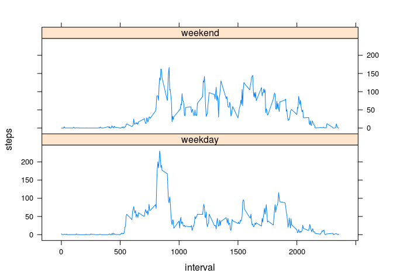

# Reproducible Research: Peer Assessment 1

We first set the general options for knitr to avoid unecessary messages.


```r
library(knitr)
opts_chunk$set(echo = FALSE)

## we want date displayed in english
## Be carefull this is depending on your operating system and configuration
## Read the documentation if problems
Sys.setlocale("LC_TIME", "en_US.utf8")
```

```
## [1] "en_US.utf8"
```

# Loading and preprocessing the data
We will use `dyplr` package for data summarization, and `xtable` for table layout in this report. 

First thing is to load the package. Note: it's not installed by default.


```r
library(dplyr)
library(xtable)
```

We need first to unzip the raw data source file `activity.csv` contained in `activity.zip` file. 

Then the data is loaded in a data.frame called `activity_data`.


```r
unzip("activity.zip")
activity_data <- read.csv("activity.csv", sep = ",", header = TRUE, stringsAsFactors = FALSE, strip.white=TRUE)
```

The data frame contains 17568 and the first and last lines of this data.frame are shown bellow.


```r
xt <- xtable(rbind(head(activity_data),tail(activity_data)))
print(xt, type = "html")
```

<!-- html table generated in R 3.2.0 by xtable 1.7-4 package -->
<!-- Sat Jun 27 22:24:03 2015 -->
<table border=1>
<tr> <th>  </th> <th> steps </th> <th> date </th> <th> interval </th>  </tr>
  <tr> <td align="right"> 1 </td> <td align="right">  </td> <td> 2012-10-01 </td> <td align="right">   0 </td> </tr>
  <tr> <td align="right"> 2 </td> <td align="right">  </td> <td> 2012-10-01 </td> <td align="right">   5 </td> </tr>
  <tr> <td align="right"> 3 </td> <td align="right">  </td> <td> 2012-10-01 </td> <td align="right">  10 </td> </tr>
  <tr> <td align="right"> 4 </td> <td align="right">  </td> <td> 2012-10-01 </td> <td align="right">  15 </td> </tr>
  <tr> <td align="right"> 5 </td> <td align="right">  </td> <td> 2012-10-01 </td> <td align="right">  20 </td> </tr>
  <tr> <td align="right"> 6 </td> <td align="right">  </td> <td> 2012-10-01 </td> <td align="right">  25 </td> </tr>
  <tr> <td align="right"> 17563 </td> <td align="right">  </td> <td> 2012-11-30 </td> <td align="right"> 2330 </td> </tr>
  <tr> <td align="right"> 17564 </td> <td align="right">  </td> <td> 2012-11-30 </td> <td align="right"> 2335 </td> </tr>
  <tr> <td align="right"> 17565 </td> <td align="right">  </td> <td> 2012-11-30 </td> <td align="right"> 2340 </td> </tr>
  <tr> <td align="right"> 17566 </td> <td align="right">  </td> <td> 2012-11-30 </td> <td align="right"> 2345 </td> </tr>
  <tr> <td align="right"> 17567 </td> <td align="right">  </td> <td> 2012-11-30 </td> <td align="right"> 2350 </td> </tr>
  <tr> <td align="right"> 17568 </td> <td align="right">  </td> <td> 2012-11-30 </td> <td align="right"> 2355 </td> </tr>
   </table>

We notice tere are missing values for the interval variable (NA shown as empty in the table above).

# What is mean total number of steps taken per day?
## Calculate the total number of steps taken per day
For this part of the analysis we do not take into account the missing values for `steps`. We group an summarize the number of steps per day (sum of steps for each day) in the data.frame `activity_data_per_day`.


```r
activity_data_per_day <- activity_data %>% group_by(date)
activity_data_per_day <- activity_data_per_day %>% summarise_each(funs(sum(., na.rm = TRUE)), steps)
```

## Make a histogram of the total number of steps taken each day


```r
p <- with(activity_data_per_day, hist(steps, breaks = 20, main = "Histogram of steps per day", xlab = "Number of steps"))
```

 

## Calculate and report the mean and median of the total number of steps taken per day


```r
mean(activity_data_per_day$steps)
```

```
## [1] 9354.23
```

```r
median(activity_data_per_day$steps)
```

```
## [1] 10395
```

# What is the average daily activity pattern?

## Time series plot of 5-minute interval across all days 
In this section we make a time series plot (i.e. type = "l" ) of the 5-minute interval (x-axis) and the average number of steps taken, averaged across all days (y-axis)

We first group the data.frame by interval across all days and summarise by mean values of steps for the interval. The we plot the time serie.


```r
activity_data_per_interval <- activity_data[!is.na(activity_data$steps),] %>% group_by(interval)
activity_data_per_interval <- activity_data_per_interval %>% summarise_each(funs(mean(., na.rm=TRUE)), steps)

with(activity_data_per_interval, plot(x = interval, y = steps, type = 'l', xlab = 'Interval reference', ylab = 'average number of steps', main = 'Average Nb of steps per 5-min interval'))
```

 

## Which 5-minute interval contains the maximum number of steps?
We calculate the max number of steps, on average across all the days in the dataset for intervals and look for the associated interval.


```r
maxStepsInterval <- activity_data_per_interval[activity_data_per_interval$steps == max(activity_data_per_interval$steps),]$interval
```

The reference of the interval is 835 and number of steps during is interval is in average 206.17


# Imputing missing values

## Calculate and report the total number of missing values 
We count the number of missing values in the dataset (i.e. the total number of rows with NA s)

```r
sum(is.na(activity_data$steps))
```

```
## [1] 2304
```

```r
sum(is.na(activity_data$date))
```

```
## [1] 0
```

## Devise a strategy for filling in all of the missing values in the dataset. 
In order to fill the missing value we decide to replace the NAs with the mean value of the associated interval across days.

Thus, we will replace NA values in steps by the mean value of the interval calculated in previous section.

## Create a new dataset that is equal to the original dataset but with the missing data filled in.
We substitute the missing data (NA) by mean value of the associated interval. For this purpose we use the `merge` function of `dplyr` package and select initial columns only.


```r
activity_data_fixed <- merge(activity_data, activity_data_per_interval, by.x = "interval", by.y = "interval")
activity_data_fixed[is.na(activity_data_fixed$steps.x),]$steps.x <- activity_data_fixed[is.na(activity_data_fixed$steps.x),]$steps.y
activity_data_fixed <- select(activity_data_fixed, interval, steps.x, date)
names(activity_data_fixed) <- c("interval", "steps","date")
```

## Make a histogram of the total number of steps taken each day


```r
activity_data_fixed_per_day <- activity_data_fixed %>% group_by(date)
activity_data_fixed_per_day <- activity_data_fixed_per_day %>% summarise_each(funs(sum), steps)


with(activity_data_fixed_per_day, hist(steps, breaks = 20, main = "Histogram of steps per day", xlab = "Number of steps"))
```

 

## Calculate and report the mean and median total number of steps taken per day. 


```r
mean(activity_data_fixed_per_day$steps)
```

```
## [1] 10766.19
```

```r
median(activity_data_fixed_per_day$steps)
```

```
## [1] 10766.19
```

## Do these values differ from the estimates from the first part of the assignment? 
There is very limited impact of NA when replaced by taking the mean of associated interval. The gap in is -15.09% for mean and -3.57% for median.

## What is the impact of imputing missing data on the estimates of the total daily number of steps?
Based on previous values and results in previsou section, imputing the missing values affecting mainly the mean value of steps. This is due to 7 days for which there is a difference in total number of steps, these days had NA values for steps. These NA values are replaced by the mean values of each interval, thus the total of replace values match the mean value of total daily number of steps : ~10k. See bellow histogram showing the distribution of difference in total daily number of steps between data set with fixed NA and initial.


```r
p <- hist((activity_data_fixed_per_day$steps - activity_data_per_day$steps), breaks = 20, main = "Histogram of different of number of steps with or without fixing NA", xlab = "Number of steps")
```

 


# Are there differences in activity patterns between weekdays and weekends?
We create a new factor variable (period) in the dataset with two levels indicating whether a given date is a weekday or weekend day.

- “weekday” 
- “weekend” 


```r
# identify day of the week in variable weekday
activity_data_fixed$weekday <- weekdays(strptime(activity_data_fixed$date, format = '%Y-%m-%d'))
# initialise all days as weekday for variable `period`
activity_data_fixed$period <- 'weekday'
# replace by `weekend` for Sat and Sun
activity_data_fixed[activity_data_fixed$weekday == 'Saturday' | activity_data_fixed$weekday == 'Sunday',]$period <- 'weekend'
activity_data_fixed$period <- as.factor(activity_data_fixed$period)

activity_data_fixed <- activity_data_fixed %>% group_by(period, interval)
activity_data_fixed <- activity_data_fixed %>% summarise_each(funs(mean(., na.rm = TRUE)), steps)
```

Then we plot using lattice package as time series both weekend and weekdays number of steps vs. interval. Once can notice that weekdays have more early steps while pattern of weekends are shifted to later intervals.


```r
library(lattice)
with(activity_data_fixed, xyplot(steps ~ interval | period, type = "l", layout = c(1,2)))
```

 
